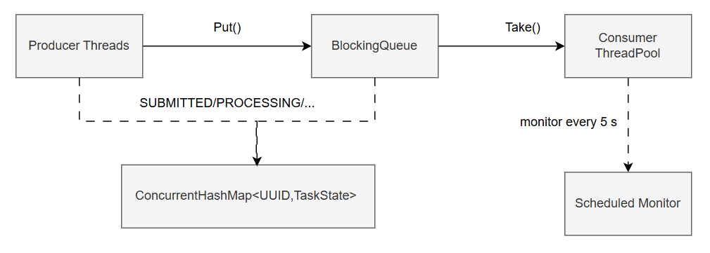

[//]: # (![challenge banner]&#40;image/amaliTechLab.webp&#41;)

# Advanced Lab4: Concurrent Task Dispatch System

The lab shows how to build a thread‑safe producer‑consumer pipeline with priority handling, 
live monitoring, and graceful shutdown.

## Video

* Final Project: Not Available for now!

## Diagram
* Component diagram: <a href="https://drive.google.com/file/d/1uBQmBDXAz1MAq28z5upg5YuPCOW0Rg80/view?usp=sharing">Available here</a>
  

---
## Usage
* How to Run : Logic behind the implementation
    - Inside src directory there is main open it and click on run icon.
    - the project has no dependency tools just a simple Java application.

## Components

| Component         | Role                                                                                                                                                            |
|-------------------|-----------------------------------------------------------------------------------------------------------------------------------------------------------------|
| **Task**          | Immutable work item (UUID, name, priority, payload, duration) implements `Comparable` so it sorts by priority.                                                  |
| **Producers**     | Generate tasks and `put()` them into the shared queue. 2 threads in the demo.                                                                                   |
| **Shared Queue**  | *Choose at runtime*: `PriorityBlockingQueue` (unbounded, strict ordering) **or** `LinkedBlockingQueue` (FIFO, optional capacity).                               |
| **Consumers**     | worker threads inside a `ThreadPoolExecutor`. Each `take()`s a task, marks it **PROCESSING**, sleeps for the requested duration, then marks **COMPLETED**.      |
| **Status Map**    | `ConcurrentHashMap<UUID, TaskState>` — tracks state (`SUBMITTED`, `PROCESSING`, `COMPLETED`, `FAILED`) **and last‑updated timestamp** for stuck‑task detection. |
| **Monitor**       | A single‑thread `ScheduledExecutorService` prints queue length, active worker count, completed‑task count.                                                      |
| **Shutdown Hook** | Runs on JVM termination ⇢ interrupts producers, gracefully shuts the pool, stops the monitor, drains leftover tasks, logs a final summary.                      |

## Expected Learning Outcomes

- Solidify understanding of Java concurrency primitives and memory consistency
- Develop real-world concurrency patterns (producer-consumer, thread pools)
- Detect and fix synchronization issues and race conditions
- Build and test a robust multithreaded system with real-time status tracking
